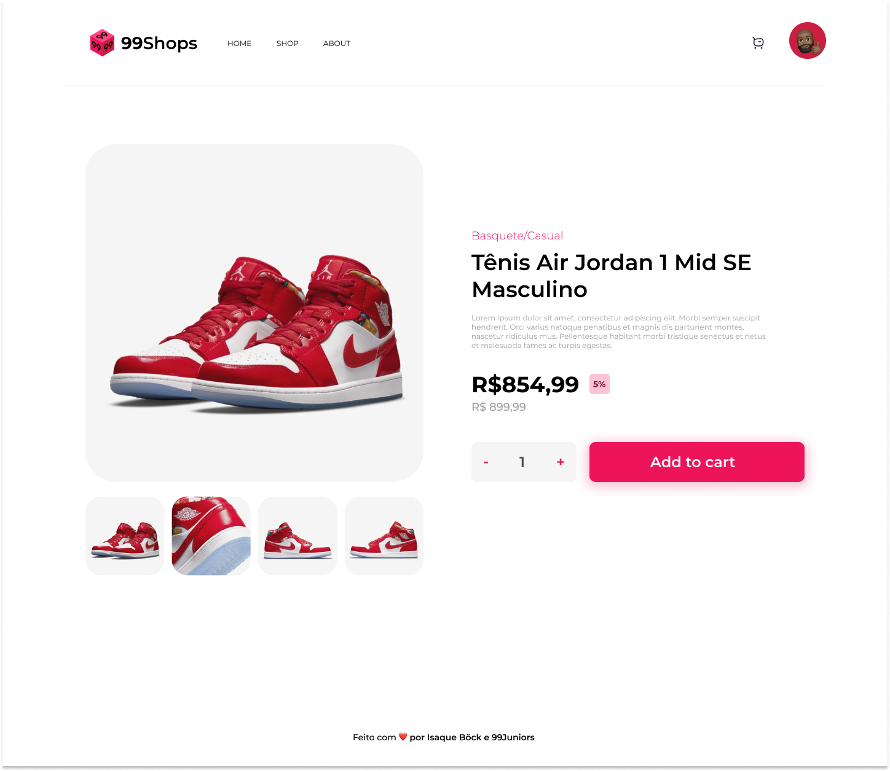

- - -

<h2 align="center">Desafio por <a href="https://www.linkedin.com/in/isaquebock/">Isaque Böck</a> e <a href="https://99juniors.com/">99Juniors</a></h2>

<h3 align="center">Página de Produto de um e-commerce.</h3>

# Índice

* [Requisitos](#Requisitos) 
* [Design](#Design)
* [Tecnologias](#Tecnologias)
* [Compartilhe](#Compartilhe)

 

# Requisitos

- Sua página deverá ter um menu exatemente igual ao wireframe proposto. Deverá contar também com um menu hamburguer no mobile, o qual trás o menu lateralmente clicando nele. Veja o exemplo no [site](https://ecommerce-product-page-crfjpg09b-isaquebock.vercel.app/).

- Sua página devera ter miniaturas abaixo da imagem principal do produto e deverá ser possível clicar nelas e mudar a imagem principal.

- Sua página deverá contar com um componente de quantidade como o que está proposto no wireframe, e a quantidade não pode ser menor de 1, nem maior que 99.

- O contador do carrinho deverá mudar ao clicar no botão **Add to cart** de acordo com o valor selecionado o componente de quantidade.

- No mobile, a troca de imagens do produto deverá acontecer por meio de bullets. Veja o exemplo no [site (mude para alguma versão de dispositivo móvel)](https://ecommerce-product-page-crfjpg09b-isaquebock.vercel.app/).

 

# Design

Design do [projeto](https://www.figma.com/file/HareEI6GIB78uiHg1ajLx7/E-commerce-Product-Page-Challlenge) desenvolvido no figma.

 

# Tecnologias

- HTML, CSS, Javascript.

- Poderá utilizar bibliotecas caso queira.

 

# Compartilhe!

Faça um print, gif ou vídeo e compartilhe o resultado no seu Linkedin e na comunidade da [99](https://discord.gg/zyBxc6kU).
Você tambm pode adicionar uma "issue" neste repositório mostrando seu resultado final!

 